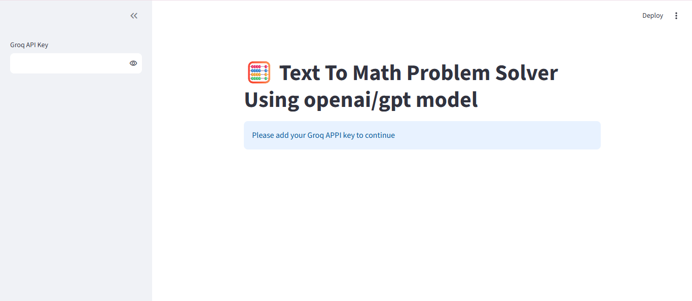
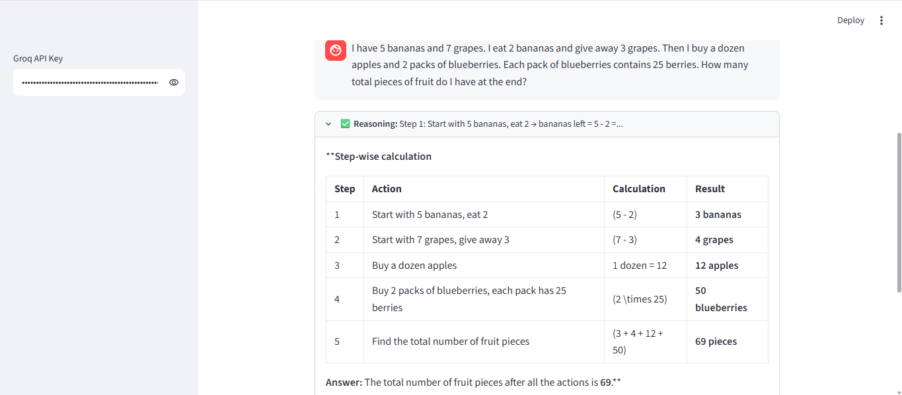

# 🧮 Text to Math Problem Solver & Knowledge Assistant

An AI-powered web application that solves mathematical problems with logical reasoning, performs calculations, and answers general knowledge questions using Wikipedia. Built with **Streamlit**, **LangChain**, and **Groq's openai/gpt-oss-120b** model, the application intelligently selects the appropriate tool to provide accurate and detailed responses.

---

## 🚀 Live Demo

🔗 **Application:** https://gen-ai---math-problem-solver-uhhvprnhhapnwqtuwjndft.streamlit.app/

---

## 📌 Features

- 🧠 Solves mathematical word problems with step-by-step reasoning
- ➕ Performs mathematical calculations using an AI-powered calculator
- 📚 Retrieves factual information from Wikipedia
- 🤖 Uses LangChain Agents for intelligent tool selection
- 💬 Interactive chat interface built with Streamlit
- ⚡ Powered by Groq's high-speed inference
- 🔄 Maintains chat history during the session
- 🎯 Handles both mathematical and general knowledge queries

---

## 🛠️ Tech Stack

- Python
- Streamlit
- LangChain
- Groq API
- openai/gpt-oss-120b
- Wikipedia API
- LLMMathChain
- LangChain Agents

---

## 📂 Project Structure

```
Text-To-Math-Problem-Solver/
│
├── app.py
├── requirements.txt
├── README.md
└── images/
    ├── home.png
    └── output.png
```

---

## ⚙️ Installation

### 1. Clone the Repository

```bash
git clone https://github.com/Atmuri-SatyaPrakash/Gen-AI---Text-To-Math-Problem-Solver.git
```

```bash
cd Gen-AI---Text-To-Math-Problem-Solver
```

---

### 2. Create a Virtual Environment

#### Windows

```bash
python -m venv venv
venv\Scripts\activate
```

#### macOS/Linux

```bash
python3 -m venv venv
source venv/bin/activate
```

---

### 3. Install Dependencies

```bash
pip install -r requirements.txt
```

---

## ▶️ Run the Application

```bash
streamlit run app.py
```

---

## 🔑 Groq API Key

Generate a free API key from:

https://console.groq.com/keys

Launch the application and paste your API key into the sidebar to begin using the chatbot.

---

## 🤖 AI Tools Used

### 🧠 Reasoning Tool

- Breaks down mathematical word problems
- Provides logical step-by-step reasoning
- Converts the problem into mathematical expressions
- Explains the complete solution clearly

---

### ➕ Calculator Tool

- Evaluates mathematical expressions
- Performs arithmetic calculations
- Used after reasoning for accurate computation

---

### 📚 Wikipedia Tool

- Searches Wikipedia for factual information
- Answers general knowledge questions
- Retrieves concise summaries of topics

---

## 🔄 How It Works

1. The user enters a question.
2. The LangChain Agent analyzes the query.
3. Depending on the question, it automatically selects the appropriate tool:
   - **Reasoning Tool** for mathematical word problems
   - **Calculator Tool** for mathematical computations
   - **Wikipedia Tool** for factual and informational queries
4. The final response is displayed in the Streamlit chat interface.

---

## 📸 Application Preview

### Home Screen





---

### Response Example




---

## 📦 Requirements

Example dependencies:

```text
streamlit
langchain
langchain-groq
langchain-community
wikipedia
numexpr
```

Install all packages using:

```bash
pip install -r requirements.txt
```

---

## 💡 Example Questions

### Mathematics

- What is 256 × 48?
- Solve (35 + 48) × 12.
- Find the square root of 4096.
- If I have 5 bananas and 7 grapes, eat 2 bananas and give away 3 grapes, then buy a dozen apples and 2 packs of blueberries containing 25 berries each, how many fruits do I have?

### General Knowledge

- Who invented Python?
- Tell me about Artificial Intelligence.
- What is Machine Learning?
- Explain Quantum Computing.
- Who is Alan Turing?

---

## 🌟 Future Enhancements

- 📄 PDF question solving
- 📈 Mathematical graph plotting
- 🎤 Voice input support
- 📷 OCR for handwritten math problems
- 📝 LaTeX equation rendering
- 💾 Chat history export
- 🌍 Multiple language support

---

## 👨‍💻 Author

**Atmuri Satya Prakash**

- GitHub: https://github.com/Atmuri-SatyaPrakash
- LinkedIn: https://www.linkedin.com/in/atmurisatyaprakash/
- Live Demo: https://gen-ai---math-problem-solver-uhhvprnhhapnwqtuwjndft.streamlit.app/

---

## ⭐ Support

If you found this project useful, please consider giving it a ⭐ on GitHub. It helps others discover the project and supports future development.

---
